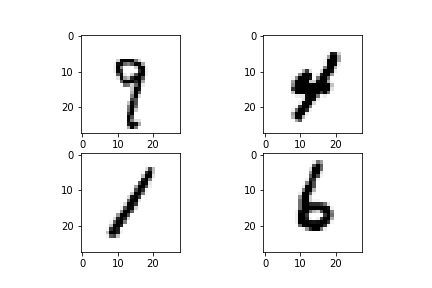

## Ahmed Asini
Here are some projects I worked on.
# Algorithms:
## [Project 1: Wilson algorithm for uniform spanning tree:](https://github.com/AhmedASN/Wilson-Algorithm-for-uniform-spanning-tree)
* 1st part : A theoretical one.Basing on the loop-erased random walk model, We demonstrate the correctness of the algorithm.
* 2nd part : An implementation of the algorithm in Python 
* Results of runing the algorithm on grids of different size:  

 

# Data Science:
## [Project 1: Hand written digits recognition using CNN-keras:](https://github.com/AhmedASN/Hand-written-digits-recognition-CNN-keras-)
MNIST ("Modified National Institute of Standards and Technology") is the de facto “hello world” dataset of computer vision. We use two convolutional neural networks, one is based on Conv2D and the other on SeparableConv2D from Keras,  to recognize hand written digits.

The neural networks will be training on a data set with the following property :

CNN (Convolutional Neural Network) based on Conv2D achieved ***99.8%*** in accuracy while CNN based on SeparableConv2D achieved ***98.5% ***
